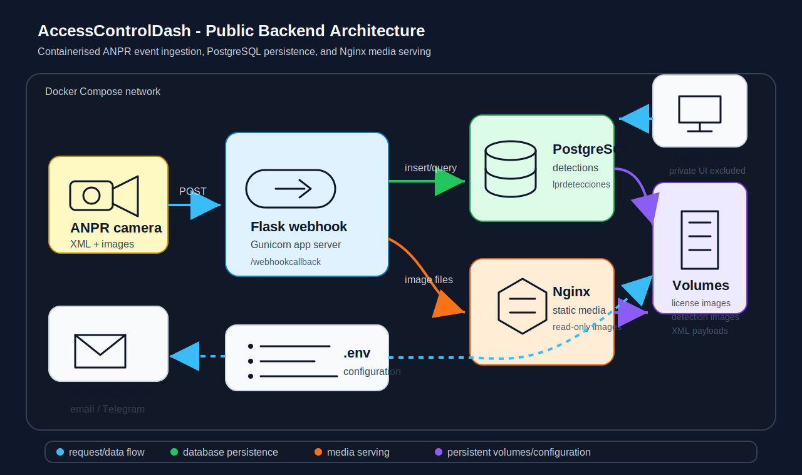

# AccessControlDash Public

Public-safe backend and infrastructure layer for an ANPR-based access-control platform.

This repository shows how the platform receives camera events, processes webhook payloads, stores structured detections, persists image evidence, and serves media assets through a containerised Linux deployment. The private dashboard/UI and production-specific infrastructure are intentionally excluded.

## Portfolio Summary

Designed and implemented a reusable Linux-Docker-Python backend that integrates ANPR camera webhooks, a Flask/Gunicorn service, PostgreSQL persistence, Nginx static media serving, and Docker Compose orchestration to support access-control visibility and operational vehicle review workflows.

## System Architecture



## What This Repository Demonstrates

- **Solution architecture:** a multi-service backend split into webhook processing, database persistence, media serving, configuration, and persistent storage.
- **API/data-flow integration:** camera webhooks are transformed from XML/image payloads into structured database records and reusable image assets.
- **Deployment thinking:** services are containerised with Dockerfiles and coordinated with Docker Compose.
- **Security-aware design:** secrets are environment-based, generated media routes disable directory browsing, and production credentials/domains are removed.
- **Operational value:** raw ANPR events become searchable, reviewable access-control data for a separate dashboard workflow.

## Included Services

| Service | Technology | Responsibility |
| --- | --- | --- |
| `Webhook` | Python, Flask, Gunicorn | Receives ANPR callbacks, parses XML, validates image uploads, writes detections, and can send optional notifications. |
| `DB` | PostgreSQL | Stores access-control records, vehicle-related tables, and `lprdetecciones` detection events. |
| `Nginx` | Nginx | Serves generated license-plate and detection images from read-only Docker volumes. |
| `docker-compose.yml` | Docker Compose | Builds and runs the backend, database, Nginx, and persistent volumes together. |
| `.env.example` | Environment config | Documents runtime configuration without publishing real secrets. |

## Data Flow

1. An ANPR camera sends XML metadata and images to `POST /webhookcallback`.
2. The Flask/Gunicorn service parses the payload, validates file types, normalises fields, and handles duplicate detection logic.
3. Detection metadata is written into PostgreSQL.
4. License-plate images, detection images, and XML payloads are stored in persistent Docker volumes.
5. Nginx exposes generated image assets through static routes for downstream dashboard/review use.
6. Optional email or Telegram alerts can be enabled through environment variables.

For more detail, see [docs/data-flow.md](docs/data-flow.md).

## Quick Start

```bash
cp .env.example .env
docker compose up --build
```

Default local endpoints:

- Webhook: `http://localhost:5000/webhookcallback`
- License image files: `http://localhost/licenseimage/<filename>`
- Detection image files: `http://localhost/detectionimage/<filename>`

## Repository Layout

```text
.
|-- DB/
|   |-- Dockerfile
|   |-- init_schema.sql
|   `-- postgres-custom.conf
|-- Nginx/
|   |-- Dockerfile
|   `-- public-assets-nginx.conf
|-- Webhook/
|   |-- Dockerfile
|   |-- anpr_webhook_app.py
|   |-- license_plate_validator.py
|   `-- requirements.txt
|-- diagrams/
|   `-- system-architecture.svg
|-- docs/
|   `-- data-flow.md
|-- .env.example
|-- .gitignore
`-- docker-compose.yml
```

## Public-Safe Scope

Included:

- backend service code
- PostgreSQL schema
- Nginx media-serving configuration
- Docker Compose infrastructure
- public-safe environment template
- architecture and data-flow documentation

Excluded:

- private dashboard/UI service
- production domains and infrastructure details
- real credentials, tokens, chat IDs, and email passwords
- client-specific private deployment information

## Security Notes

- Replace all default passwords before any non-local deployment.
- Keep secrets in `.env` or a deployment secret store, not in Git.
- Use HTTPS and source restrictions for production webhook endpoints.
- Configure `WEBHOOK_SECRET` for HMAC signature validation where possible.
- Keep generated image directories private unless the surrounding deployment controls access.
- Rotate credentials and notification tokens after demos or environment changes.

## Why It Matters

This project is a portfolio example of production-style solution engineering: it connects an external event source, backend processing, persistent storage, static media delivery, configuration management, and operational review needs into one deployable architecture.
